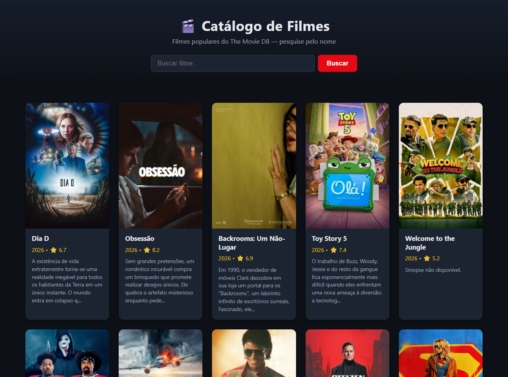
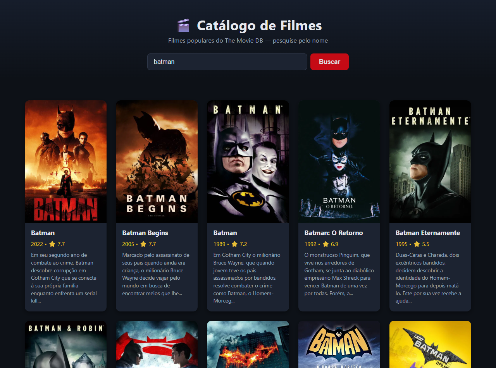

# Catálogo de Filmes com TMDB — Semana 12

Atividade prática de **Desenvolvimento de Interfaces Web (PUC Minas)**:
consumo da API do The Movie DB com Fetch API, renderização dinâmica no DOM
e pesquisa de filmes por nome.

**Nome:** Hector Paulo | **Matrícula:** 1632595

## Endpoints utilizados

- `/movie/popular` — listagem inicial de filmes populares (carregada ao abrir a página)
- `/search/movie` — pesquisa de filmes pelo nome digitado

## Como executar

1. Crie uma conta em [themoviedb.org](https://www.themoviedb.org/) e gere uma API Key
   (Configurações → API).
2. No topo do `script.js`, substitua `"SUA_CHAVE_AQUI"` pela sua chave.
3. Abra o `index.html` no navegador.

## Prints da aplicação

### 1. Lista de filmes populares carregada

### 2. Resultado após uma pesquisa

## Fluxo da aplicação

A página dispara uma requisição assíncrona à API do TMDB com Fetch API e
`async/await`; a resposta JSON é tratada (título, ano, nota, sinopse limitada e
pôster com fallback) e cada filme vira um card criado dinamicamente com
`createElement`/`appendChild`. A pesquisa refaz a requisição no endpoint de busca
e atualiza a lista, com mensagens de carregando, erro e lista vazia.
